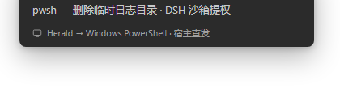
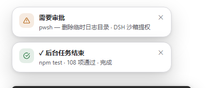

# Herald · 传令官 — dsh-herald

English | [中文](README.zh.md)

[](https://github.com/deepseek-ai/deepseek-harness)
[](https://www.npmjs.com/package/dsh-herald)
[](#tests)
[](LICENSE)

> **Task notifications for DeepSeek Harness (DSH) — delivered even when the browser is closed.**
> Approval requests · awaiting-your-reply · finished background jobs / subagents / workflows — pushed to your desktop through **three independently switchable channels**, with in-page toasts & chimes, a premium bell panel, and persistent history.

Herald, the medieval messenger who crossed the city walls — because that is literally what this plugin does: **the DSH host process raises the OS notification itself** (PowerShell WinRT on Windows, `osascript` on macOS, `notify-send` on Linux). Browser open, hidden, or fully closed — the toast still lands.



*Channel C — the host-direct OS toast on Windows, raised by the DSH process itself (no browser involved). Rendered with real payloads; backdrop recreated for privacy.*


*The bell panel in dark (follows the DSH theme) and light — card-based channel settings, per-channel test buttons, segmented theme control. Bilingual 中/EN UI.*



*Channel A — in-page toasts (top-right, 6s, hover to pause): an approval alert and a finished-job notice, exactly as the plugin renders them.*

## Why Herald

DSH runs long agent turns, background jobs, subagents and workflows. You step away for two minutes and miss the approval prompt. Notification plugins that rely on the browser's `Notification` API die silently when the page is hidden (background tabs pause polling), throttled, or the browser is closed. Herald fixes the delivery architecture itself — the **host** is the notifier.

**Search-friendly summary**: DSH plugin · agent task notifications · approval alerts · desktop notifications · system notification center · Windows toast · macOS notification · background job alerts · subagent / workflow completion · in-page toasts · bell panel · notification history.

## The three channels

| Channel | What it is | Switch lives in | Delivers when |
|---|---|---|---|
| **A · In-browser alerts** | Toast overlays + chimes rendered by the page | per-browser (`localStorage`) | switch on |
| **B · Browser OS banners** | Banners the page requests via the browser `Notification` API | per-browser (`localStorage`) | switch on **and** host not delivering (stands by — never double banners) |
| **C · Host-direct OS toasts** | The DSH host process raises OS-center toasts itself | host-side (`settings.json`, cross-browser, works headless) | switch on + platform adapter |

| C host | B browser | OS banner source | Browser closed? |
|:---:|:---:|---|---|
| ON | ON | host only (B stands by) | ✅ still notified |
| ON | OFF | host only | ✅ still notified |
| OFF | ON | browser, only while browsing | ❌ |
| OFF | OFF | none (bell still records) | ❌ |

`C off + B on` is a real preference Herald makes expressible — browser-branded banners while you're at the page, silence when you're not (also right for remote GUI access: host toasts land on the server machine, browser banners on yours). `DSH_TASK_NOTIFY_OS=0|1` in the host environment overrides and locks channel C for headless operations.

## Features

- 🔔 **Tri-channel delivery** — per-channel switches with per-channel test buttons and instant switch feedback
- 🖥️ **Host-direct OS toasts** — PowerShell WinRT (zero dependencies) / `osascript` / `notify-send`, graceful degradation when no adapter exists
- 🛡️ **Anti-bombardment** — serialized spawns, 1.2s min gap, bursts fold into summary toasts (approvals are exempt), 5s timeout kill, one retry
- 🔒 **Injection-safe** — text travels base64(UTF-16LE); tags sanitized; spawns without a shell
- 🎨 **Premium panel** — status-dot health strip, segmented theme control, custom slider/switches, entrance animations (reduced-motion safe), 中/EN
- 🔊 **Direction-encoded chimes** — approvals double-tap, replies ascend, failures descend
- 💾 **Persistent history** — 300 records, atomic writes, corrupt-file recovery; channel settings and history live under `<profile>/data/task-notify/`, surviving reinstalls and the rename from upstream
- ⚡ **Incremental sync** — `pullSince` change feed, adaptive polling 1.5→5s, legacy-host fallback
- 🧪 **108 tests**, zero runtime dependencies beyond DSH's own packages

## Install

Requires Node.js + pnpm. After installing: restart `dsh web`, then hard-refresh the page (`Ctrl+F5`).

### npm (recommended)

```sh
dsh plugin --profile web add dsh-herald
```

### From GitHub

```sh
dsh plugin --profile web add git+https://github.com/bululuburuarua666/dsh-herald.git
```

### Manual (offline)

Download [`dsh-herald-1.0.1.zip`](https://github.com/bululuburuarua666/dsh-herald/releases) from the releases, extract, and copy `lib/`, `package.json`, `cordis.patch.yml` into `~/.dsh/profiles/<name>/node_modules/dsh-herald/`. Then append to `~/.dsh/profiles/<name>/cordis.patch.yml`:

```yaml
- insert:
    - id: herald
      name: 'dsh-herald'
```

### Upgrading from upstream dsh-task-notify

Remove the old package and its composition row, then install Herald. History (`records.json`), channel settings (`settings.json`) and per-browser preferences carry over — the data directory resolves independently of the package name, and localStorage keys are unchanged from upstream.

### First run

Click the 🔔 bell → expand the drawer (▸) → 通知通道 holds all three switches with test buttons. Host-direct toasts need no permission; channel B asks for the browser grant via its own test button.

## How it works

```
events (approval/request · agent/turn-stopping · subagent/end ·
        workflow/end · jobs.onJobDone)
   │
   ▼
push() ── new record ──► queue (persistent, cap 300) ──► pullSince polling
   │                                                        │
   └─► osnotify adapter ──► OS notification center          ▼
       (settings.json gate,                          browser page
        win32/darwin/linux)                    ├─ A: toasts + chimes
                                              └─ B: browser banners (standby
                                                   while the host delivers)
```

The **host half** (`lib/index.js` · `lib/osnotify.js` · `lib/settings.js` · `lib/store.js` · `lib/typert.js`) listens across all sessions, persists records, raises host-direct toasts for genuinely new records (key-touch dedupe), and serves the `taskNotify` Remote service plus the `ntfy_status` agent tool. The **client half** (`lib/client.js`) is a zero-build module loader entry — incremental polling, bell/panel/toasts UI, channel gating. Client↔host RPC rides the raw connection seam (`/api/taskNotify/…`) — a deliberate design avoiding the self-mounting-namespace inject deadlock.

> Client-only changes take effect on page refresh; host-side changes need a DSH restart (typert manifests are cached per package name).

## Tests

```sh
npm test
```

Node's built-in runner, no extra dependencies: client logic against mocked window/React/Notification, host queue + persistence + RPC wire-shape contracts, the OS adapter under a virtual clock, and the settings store. Host tests need the peer packages resolvable — a junction/symlink to an installed DSH profile's `node_modules` suffices.

## Relation to upstream

Herald began as [kaotusi/dsh-task-notify](https://github.com/kaotusi/dsh-task-notify) (MIT) and grew a reworked delivery architecture, tri-channel model, and UI system. Upstream bugs found and fixed along the way (see [CHANGELOG.md](CHANGELOG.md)): the web-composition inject deadlock, and a gateway parameter-dispatch mismatch that silently degraded incremental pulls, cross-tab acks, and settings writes. Herald is an independent community project compatible with DeepSeek Harness; it is not an official DeepSeek product.

## License

[MIT](LICENSE) — © 2026 kaotusi (upstream), bululuburuarua666 & contributors.

[](https://github.com/deepseek-ai/deepseek-harness)
