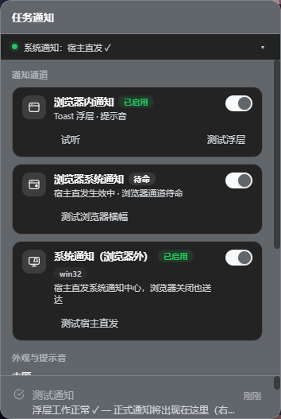
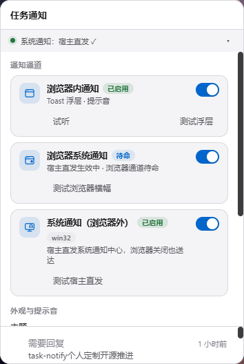

# Herald · 传令官 — dsh-herald

[English](README.md) | 中文

[](https://github.com/deepseek-ai/deepseek-harness)
[](https://www.npmjs.com/package/dsh-herald)
[](#测试)
[](LICENSE)

> **DeepSeek Harness（DSH）任务通知插件 —— 浏览器关掉，通知照达。**
> 需要审批 · 等待回复 · 后台任务/子代理/工作流结束 —— 通过**三条可独立开关的通道**送达桌面：页内浮层与提示音、浏览器系统横幅、宿主进程直发系统通知；附高级铃铛面板与持久化历史。

Herald，中世纪穿越城墙送信的传令官 —— 这正是本插件做的事：**DSH 宿主进程亲自弹出系统通知**（Windows 走 PowerShell WinRT、macOS 走 `osascript`、Linux 走 `notify-send`）。浏览器开着、隐藏、或彻底关闭 —— 通知都会到达。

## 三通道真实测试

**通道 A · 浏览器内通知** —— 页内浮层（右上角，6 秒自动消失，悬停暂停），背景即 DSH 工作台：


**通道 B · 浏览器系统通知** —— 页面经浏览器 `Notification` API 请求的系统横幅（浏览器开着时生效，宿主直发不可用时自动接替）：


**通道 C · 系统通知（宿主直发）** —— DSH 宿主进程直接弹出系统横幅（经 Windows PowerShell WinRT 通道，全程无浏览器参与，浏览器关闭也送达）：


## 面板




*铃铛面板（深色跟随 DSH 主题 / 浅色内置切换）—— 卡片式通道设置、每通道独立测试按钮、分段式主题控件，界面中英双语。*

## 为什么需要传令官

DSH 的 agent 长任务、后台作业、子代理和工作流一跑就是几分钟起步。你离开两分钟，恰好错过审批请求。依赖浏览器 `Notification` API 的通知插件，在页面转后台（后台标签页会暂停轮询）、被节流、或浏览器关闭时**静默失效**。Herald 修的是投递架构本身 —— **由宿主进程担任通知人**。

**tag**：DSH 插件 · 任务通知 · 审批提醒 · 桌面通知 · 系统通知中心 · Windows 通知 · 后台任务提醒 · 子代理/工作流完成提醒 · 页内浮层 · 铃铛面板 · 通知历史。

## 三通道模型

| 通道 | 是什么 | 开关存于 | 何时投递 |
|---|---|---|---|
| **A · 浏览器内通知** | 页面自己渲染的浮层 + 提示音 | 每浏览器（`localStorage`） | 开关开启 |
| **B · 浏览器系统通知** | 页面经浏览器 `Notification` API 请求的系统横幅 | 每浏览器（`localStorage`） | 开关开启 **且** 宿主未直发（待命态，永不双弹） |
| **C · 系统通知（宿主直发）** | DSH 宿主进程直接弹出系统通知 | 宿主侧（`settings.json`，跨浏览器，无头环境也生效） | 开关开启 + 平台适配器可用 |

| C 宿主 | B 浏览器 | 系统横幅来源 | 浏览器关闭后 |
|:---:|:---:|---|---|
| 开 | 开 | 仅宿主（B 待命） | ✅ 照常通知 |
| 开 | 关 | 仅宿主 | ✅ 照常通知 |
| 关 | 开 | 浏览器（开着才有） | ❌ |
| 关 | 关 | 无（铃铛仍记录） | ❌ |

「C 关 + B 开」是 Herald 才能表达的偏好 —— 在页面前时收浏览器样式的横幅，离开时静默（远程打开 GUI 时也适用：宿主横幅落在服务器机器上，浏览器横幅落在你的机器上）。宿主环境变量 `DSH_TASK_NOTIFY_OS=0|1` 可覆盖并锁定通道 C，适合无头运维。

## 功能特性

- 🔔 **三通道投递** —— 每通道独立开关 + 每通道专属测试按钮 + 开关即时反馈
- 🖥️ **宿主直发系统通知** —— PowerShell WinRT（零依赖）/ `osascript` / `notify-send`，无适配器平台优雅降级
- 🛡️ **防轰炸** —— 子进程串行 + 1.2 秒最小间隔，突发通知合并为汇总横幅（审批类豁免、永远单条即弹），5 秒超时杀 + 单次重试
- 🔒 **构造性防注入** —— 文本一律 Base64(UTF-16LE) 传输，标签字符白名单，无 shell 派生
- 🎨 **高级感面板** —— 状态点健康条、分段式主题控件、自定义滑杆与开关、进场动效（尊重 reduced-motion）
- 🔊 **方向编码提示音** —— 审批双响、回复上行、失败下行
- 💾 **持久化历史** —— 300 条上限、原子写入、损坏自动恢复；历史与通道设置存于 `<profile>/data/task-notify/`，重装与包名迁移均无损
- ⚡ **增量同步** —— `pullSince` 变更流、1.5→5 秒自适应轮询、旧版宿主透明回退
- 🧪 **108 项测试**，除 DSH 自带包外零运行时依赖

## 安装

需要 Node.js + pnpm。安装后重启 `dsh web`，再硬刷新页面（`Ctrl+F5`）。

### npm（推荐）

```sh
dsh plugin --profile web add dsh-herald
```

### 从 GitHub

```sh
dsh plugin --profile web add git+https://github.com/bululuburuarua666/dsh-herald.git
```

### 手动安装（离线）

从 [Releases](https://github.com/bululuburuarua666/dsh-herald/releases) 下载 `dsh-herald-1.0.1.zip` 解压，把 `lib/`、`package.json`、`cordis.patch.yml` 拷入 `~/.dsh/profiles/<name>/node_modules/dsh-herald/`，然后在 `~/.dsh/profiles/<name>/cordis.patch.yml` 追加：

```yaml
- insert:
    - id: herald
      name: 'dsh-herald'
```

### 从上游 dsh-task-notify 升级

移除旧包与其组合行后安装 Herald。历史（`records.json`）、通道设置（`settings.json`）与各浏览器偏好全部无损沿用 —— 数据目录与包名解耦，localStorage 键与上游保持一致。

### 首次运行

点侧栏 🔔 铃铛 → 展开抽屉（▸）→ 「通知通道」内是三个开关与各自的测试按钮。宿主直发无需任何授权；通道 B 点其测试按钮时会请求浏览器通知权限。

## 实现原理

```
事件源（approval/request · agent/turn-stopping · subagent/end ·
        workflow/end · jobs.onJobDone）
   │
   ▼
push() ── 新记录 ──► 队列（持久化，上限 300）──► pullSince 轮询
   │                                              │
   └─► osnotify 适配器 ──► 系统通知中心           ▼
       （settings.json 门控，               浏览器页面
        win32/darwin/linux）                ├─ A：浮层 + 提示音
                                            └─ B：浏览器横幅（宿主
                                                 直发时待命）
```

**宿主半部**（`lib/index.js` · `lib/osnotify.js` · `lib/settings.js` · `lib/store.js` · `lib/typert.js`）跨全部会话监听、持久化记录、为新记录直发系统通知（key 触碰天然去重），并提供 `taskNotify` Remote 服务与 `ntfy_status` 诊断工具。**客户端半部**（`lib/client.js`）是零构建的模块加载器入口 —— 增量轮询、铃铛/面板/浮层 UI、通道门控。客户端与宿主的 RPC 走底层 connection seam（`/api/taskNotify/…`）—— 这是为了规避自挂载命名空间 inject 死锁的刻意设计。

> 仅改 client 文件刷新页面即生效；宿主侧改动需重启 DSH（typert 清单按包名缓存）。

## 测试

```sh
npm test
```

Node 内置测试运行器，零额外依赖：mock window/React/Notification 的客户端逻辑、宿主队列与持久化与 RPC 双形状契约、虚拟时钟下的 OS 适配器、设置存取。宿主测试要求 peer 依赖可解析 —— 对已安装 DSH profile 的 `node_modules` 做个 junction/symlink 即可。

## 与上游的关系

Herald 起源于 [kaotusi/dsh-task-notify](https://github.com/kaotusi/dsh-task-notify)（MIT），发展出重构的投递架构、三通道模型与 UI 体系。过程中发现并修复的上游缺陷（详见 [CHANGELOG.md](CHANGELOG.md)）：web 组合 inject 死锁；网关参数按位置派发导致的增量轮询、跨页已读、设置写入静默退化。Herald 是兼容 DeepSeek Harness 的独立社区项目，并非 DeepSeek 官方产品。

## 许可

[MIT](LICENSE) — © 2026 kaotusi（上游）、bululuburuarua666 及贡献者。

[](https://github.com/deepseek-ai/deepseek-harness)
